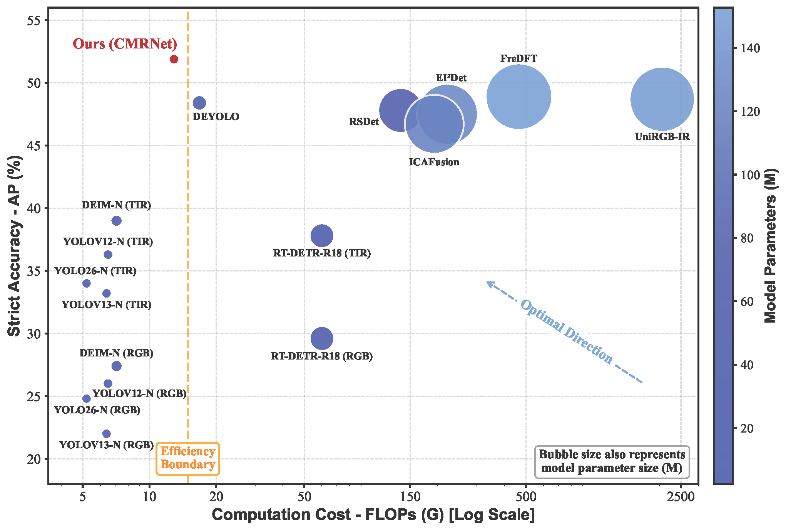

# CMRNet: A Multispectral Detection Framework Driven by Dynamic Intelligence for Coastal Environments

Welcome to the official repository for **CMRNet**.

## 📢 Update
**[Under Review]** The manuscript is currently undergoing the peer-review process. 

To comply with double-blind review policies and protect intellectual property prior to publication, the source code and the **SeaRGBT-Tiny dataset** are temporarily withheld.

**We commit to making the complete training pipeline, inference code, and dataset fully public right here immediately upon the acceptance of the paper.**

---

## 📅 Release Roadmap
- [x] Release abstract and core performance metrics.
- [ ] Release the **SeaRGBT-Tiny** dataset (images and bounding box annotations).
- [ ] Release the core network components.
- [ ] Release the complete training and evaluation pipeline.

---

## 📖 Abstract
The complementarity of visible (RGB) and thermal infrared (TIR) features is crucial in maritime monitoring and perception, especially in coastal environments characterized by complex lighting and weather factors. However, mainstream existing multispectral feature fusion methods rely on static fusion strategies, which cannot adapt to rapid changes in modality reliability, causing cross-modal feature contamination and redundant computation over large backgrounds. 

To address these issues, this paper proposes a highly efficient and dynamically intelligent multispectral detection framework called CMRNet. Specifically, to tackle cross-modal feature contamination during fusion, we design modality complementary differential feature fusion, a new fusion paradigm inspired by common-mode rejection in differential amplifiers. By explicitly modeling modal differential potential energy, it builds dynamic reliability allocation and suppresses heterogeneous noise propagation. Considering the spatial redundancy of unstructured sea surfaces, we design a polymorphic convblock that routes computation according to scene complexity, allocating network capacity to complex regions. Furthermore, to prevent tiny objects from being overwhelmed by vast backgrounds, we design a spatial density prior to guide query selection toward potential targets. 

Experiments on SeaRGBT-Tiny, MSRS, FLIR, and LLVIP show that our method achieves excellent performance. On SeaRGBT-Tiny, it obtains **51.9% AP (+6.0%)**, requiring only **3.60M parameters and 3.01ms latency**.

---

## 📈 Accuracy-Efficiency Trade-off
*(Please upload your Fig. 2 as an image named `tradeoff.png` to the repository, and it will be displayed here)*

Click to view the performance comparison

*Fig. 2. Accuracy-efficiency trade-off comparison between CMRNet and other state-of-the-art detectors.*

---

## 🚀 Main Results 

| Dataset | Model | AP (%) | Params (M) |
| :--- | :---: | :---: | :---: |
| **SeaRGBT-Tiny** | CMRNet (Ours) | **51.9** | 3.60 |
| **MSRS** | CMRNet (Ours) | **60.7** | 3.60 |
| **FLIR** | CMRNet (Ours) | **40.3** | 3.60 |
| **LLVIP** | CMRNet (Ours) | **61.9** | 3.60 |

*(Please wait for the full update after acceptance for detailed quantitative and qualitative results.)*

---
*Stay tuned for updates!*
