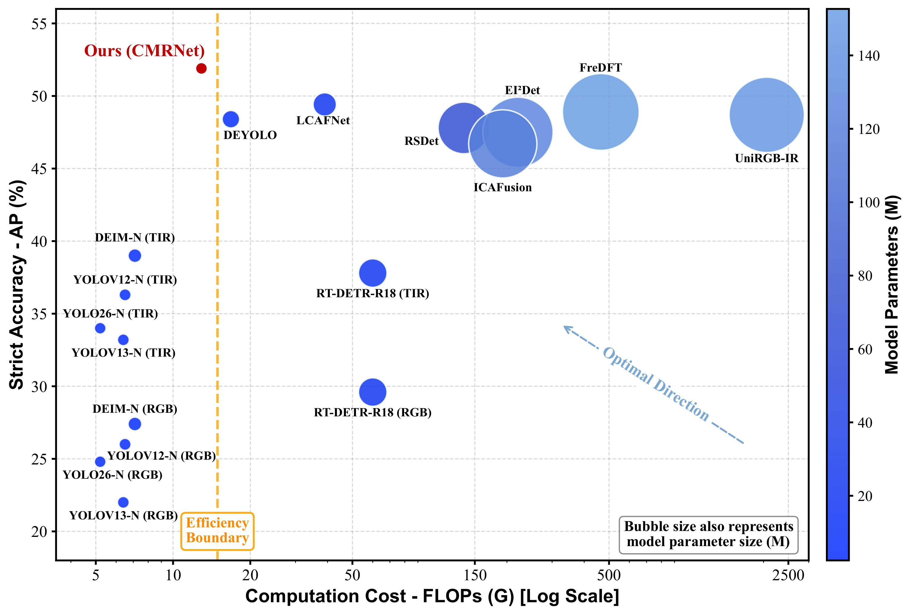

# CMRNet: A Multispectral Detection Framework Driven by Dynamic Intelligence for Coastal Environments

Welcome to the official repository for **CMRNet**.

## 📢 Update
**[Published]** 🎉 We are thrilled to announce that our manuscript has been officially accepted and published in ***Ocean Engineering*** (Volume 363, Part 4, 2026).

As promised during the review process, we have now fully open-sourced this project to support the community. This repository now contains the **Full SeaRGBT-Tiny Dataset**, the **Complete PyTorch Source Code** (including training, evaluation, and inference pipelines), and the **Model Architecture Configurations (`cmrnet_searbgttiny.yml`)**. 

---

## 📅 Release Roadmap
- [x] Release abstract and core performance metrics.
- [x] Release a sample subset of the **SeaRGBT-Tiny** dataset for format reference.
- [x] Release the environment dependencies and complete network architecture configurations.
- [x] Release the full **SeaRGBT-Tiny** dataset (images and bounding box annotations).
- [x] Release the complete PyTorch source code for training and evaluation.

---

## 📖 Abstract
The complementarity of visible (RGB) and thermal infrared (TIR) features is crucial in maritime monitoring and perception, especially in coastal environments characterized by complex lighting and weather factors. However, mainstream existing multispectral feature fusion methods rely on static fusion strategies, which cannot adapt to rapid changes in modality reliability, causing cross-modal feature contamination and redundant computation over large backgrounds. 

To address these issues, this paper proposes a highly efficient and dynamically intelligent multispectral detection framework called CMRNet. Specifically, to tackle cross-modal feature contamination during fusion, we design modality complementary differential feature fusion, a new fusion paradigm inspired by common-mode rejection in differential amplifiers. By explicitly modeling modal differential potential energy, it builds dynamic reliability allocation and suppresses heterogeneous noise propagation. Considering the spatial redundancy of unstructured sea surfaces, we design a polymorphic convblock that routes computation according to scene complexity, allocating network capacity to complex regions. Furthermore, to prevent tiny objects from being overwhelmed by vast backgrounds, we design a spatial density prior to guide query selection toward potential targets. 

Experiments on SeaRGBT-Tiny, MSRS, FLIR, and LLVIP show that our method achieves excellent performance. On SeaRGBT-Tiny, it obtains **51.9% AP (+6.0%)**, requiring only **3.60M parameters and 3.01ms latency**.

---

## 💻 Architecture Proof & Configurations
To ensure absolute transparency and reproducibility, we provide the `cmrnet_searbgttiny.yml` file. This file explicitly details the **complete structural logic of the CMRNet framework** (including the integration of MCDF, PolyBlock, and DGQS), along with our **core training pipeline** (hyperparameters, optimizers, and dual-modality data augmentation strategies like Mosaic and ModalStack).

Below is a snapshot of our training terminal, which verifies the model's lightweight footprint (**3.60M Parameters**) and successful structural execution.

<details open>
<summary>Click to view the training terminal log</summary>


*Terminal output during the initialization phase of CMRNet training.*
</details>

---

## 📈 Accuracy-Efficiency Trade-off

<details open>
<summary>Click to view the performance comparison</summary>


*Fig. 6. Accuracy-efficiency trade-off comparison between CMRNet and other state-of-the-art detectors.*
</details>

---

## 🚀 Main Results 

| Dataset | Model | AP (%) | Params (M) |
| :--- | :---: | :---: | :---: |
| **SeaRGBT-Tiny** | CMRNet (Ours) | **51.9** | 3.60 |
| **MSRS** | CMRNet (Ours) | **60.7** | 3.60 |
| **FLIR** | CMRNet (Ours) | **40.3** | 3.60 |
| **LLVIP** | CMRNet (Ours) | **61.9** | 3.60 |

---

## 📝 Citation

If you find our work or the SeaRGBT-Tiny dataset useful in your research, please consider citing our paper:

```bibtex
@article{li2026cmrnet,
  title={CMRNet: A multispectral detection framework driven by dynamic intelligence for coastal environments},
  author={Li, Pan and Huang, Xixia and An, Shunmin and Zhang, Lingqiao and Zhang, Yilian},
  journal={Ocean Engineering},
  volume={363},
  pages={126689},
  year={2026},
  publisher={Elsevier},
  doi={10.1016/j.oceaneng.2026.126689}
}
